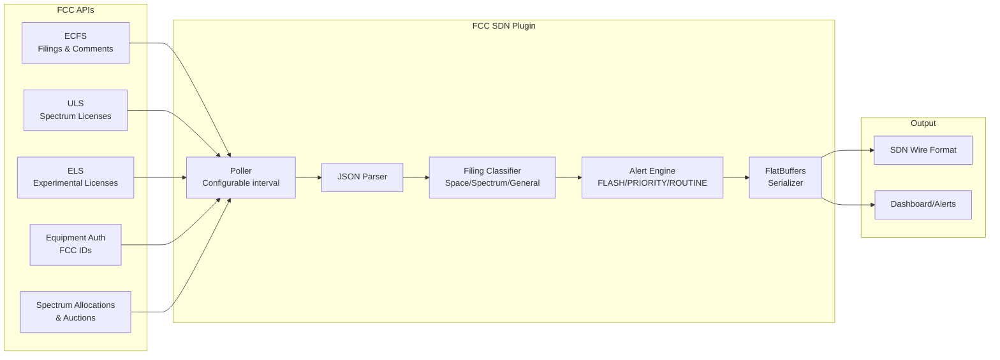
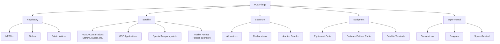

# 📡 FCC Filing Monitor — SDN Plugin

[](LICENSE)
[](https://isocpp.org/)
[](https://webassembly.org/)
[](https://publicapi.fcc.gov)

> Real-time FCC filing intelligence for the Space Data Network — satellite licenses, spectrum allocations, experimental authorizations, and regulatory changes that affect space operations.

## Overview

The FCC processes thousands of filings daily across multiple systems: ECFS (comments/rulemakings), ULS (spectrum licenses), equipment authorizations, and experimental licenses. This plugin polls those systems, classifies filings by relevance to space operations, and generates structured alerts when something significant happens — a new NGSO constellation filing, spectrum reallocation affecting satcom bands, or an experimental authorization for a novel space technology.

Think of it as your regulatory radar. You'll know about Starlink's next license modification, a new V-band spectrum proposal, or an experimental space-to-ground laser comm license before it hits the news.

## Architecture



## Data Sources & APIs

| Source | URL | Auth | What It Provides |
|--------|-----|------|-----------------|
| **ECFS** | [publicapi.fcc.gov/ecfs](https://publicapi.fcc.gov/ecfs/filings) | Free API key | Filings, comments, ex parte notices, NPRMs, Orders |
| **ULS** | [publicapi.fcc.gov/uls](https://publicapi.fcc.gov/uls/licenses) | Free API key | Spectrum licenses, satellite authorizations, earth stations |
| **Equipment Auth** | [transition.fcc.gov/oet/ea/fccid](https://transition.fcc.gov/oet/ea/fccid/) | None | FCC ID equipment certifications |
| **Experimental** | [apps.fcc.gov/oetcf/els](https://apps.fcc.gov/oetcf/els/reports/GenericSearch.cfm) | None | Part 5 experimental licenses |
| **Spectrum Dashboard** | [fcc.gov/spectrum-dashboard](https://www.fcc.gov/general/spectrum-dashboard) | None | Allocation table, auction results |
| **Auction Data** | [auctiondata.fcc.gov](https://auctiondata.fcc.gov/) | None | Spectrum auction results and bidding data |

### Get an API Key

Free, instant registration at [publicapi.fcc.gov](https://publicapi.fcc.gov). Note: many endpoints work without a key but with lower rate limits.

## Filing Types Tracked



## Alert Classification

| Severity | Trigger Examples |
|----------|-----------------|
| 🔴 **FLASH** | FCC Order affecting satellite operations, spectrum reallocation in satcom bands, auction results |
| 🟡 **PRIORITY** | New NPRM, satellite license application, NGSO constellation modification |
| 🔵 **ROUTINE** | Ex parte notices, comments on open proceedings, equipment certifications |

## Key Dockets to Watch

| Docket | Subject | Why It Matters |
|--------|---------|----------------|
| 22-271 | Single Network Future | Next-gen spectrum sharing framework |
| 20-443 | 12 GHz Band | Ku-band spectrum for 5G vs. satellite |
| 18-122 | V-band NGSO | 37.5-42.5 GHz constellation licensing |
| 17-183 | Orbital Debris | Debris mitigation rules for satellite operators |
| 16-408 | Spectrum Frontiers | Above-24 GHz spectrum allocation |

## Technical Details

### Filing Classification Algorithm

```
for each new_filing:
    if bureau == "Space" OR keywords match satellite_terms:
        → satellite_related = true
    if frequency_data present OR bureau == "Wireless":
        → spectrum_related = true

    severity = classify(filing_type, satellite_related, spectrum_related)
    if severity >= threshold:
        emit alert
```

### Satellite Terms Filter
The classifier watches for: constellation, NGSO, GSO, orbital, satellite, earth station, space station, spectrum sharing, interference, Part 25, ITU coordination, Ka-band, Ku-band, V-band, Q-band, S-band, L-band, C-band, downlink, uplink, transponder, beam, footprint.

## Build

```bash
# Clone with submodules
git clone --recursive https://github.com/the-lobsternaut/fcc-sdn-plugin.git
cd fcc-sdn-plugin

# Build WASM (auto-installs emsdk on first run)
./build.sh

# Build native tests
mkdir -p src/cpp/build && cd src/cpp/build
cmake ..
make
./test_fcc
```

## Usage

```javascript
// Load the WASM module
const createFCCPlugin = require('./wasm/node/fcc_plugin.js');
const plugin = await createFCCPlugin();

// Poll for recent filings (last 24 hours)
const apiKey = process.env.FCC_API_KEY || '';
const outputPtr = plugin._wasm_malloc(1024 * 1024);
const outputLen = plugin._wasm_malloc(4);

const count = plugin._poll_filings(apiKey, apiKey.length, 24, outputPtr, outputLen);
console.log(`Found ${count} new filings`);

// Check for alerts
const alertCount = plugin._check_alerts(apiKey, apiKey.length, 24, outputPtr, outputLen);
console.log(`${alertCount} significant filing alerts`);

plugin._wasm_free(outputPtr);
plugin._wasm_free(outputLen);
```

## Plugin Manifest

```json
{
  "schemaVersion": 1,
  "name": "fcc-filing-monitor",
  "version": "0.1.0",
  "description": "FCC filing and spectrum intelligence — polls ECFS filings, spectrum allocations, satellite/earth station licenses, experimental authorizations, equipment certifications, and ULS records.",
  "author": "the-lobsternaut",
  "license": "MIT",
  "inputFormats": ["application/json"],
  "outputFormat": "application/octet-stream",
  "tags": ["fcc", "spectrum", "regulatory", "satellite-license", "ecfs", "uls", "filing", "osint"]
}
```

## References

- [FCC Public API Documentation](https://publicapi.fcc.gov)
- [FCC ECFS Search](https://www.fcc.gov/ecfs/search/search-filings)
- [FCC ULS License Search](https://wireless2.fcc.gov/UlsApp/UlsSearch/searchLicense.jsp)
- [FCC Spectrum Dashboard](https://www.fcc.gov/general/spectrum-dashboard)
- [FCC Equipment Authorization Search](https://apps.fcc.gov/oetcf/tcb/reports/Tcb731702.cfm)
- [FCC Experimental Licensing](https://apps.fcc.gov/oetcf/els/reports/GenericSearch.cfm)
- [ITU Radio Regulations](https://www.itu.int/pub/R-REG-RR)
- [NTIA Manual of Regulations & Procedures for Federal Radio Frequency Management](https://www.ntia.doc.gov/page/2011/manual-regulations-and-procedures-federal-radio-frequency-management-redbook)

## Related Plugins

- [`satfoot`](../satfoot/) — Satellite footprint analysis (uses FCC license data for RF parameters)
- [`adsb`](../adsb/) — ADS-B aircraft tracking (FCC-certified transponders)
- [`kiwisdr`](../kiwisdr/) — HF radio monitoring (FCC-licensed SDR receivers)
- [`gps-jamming-detection`](../gps-jamming-detection/) — GPS interference detection (FCC enforcement cases)

## License

MIT
